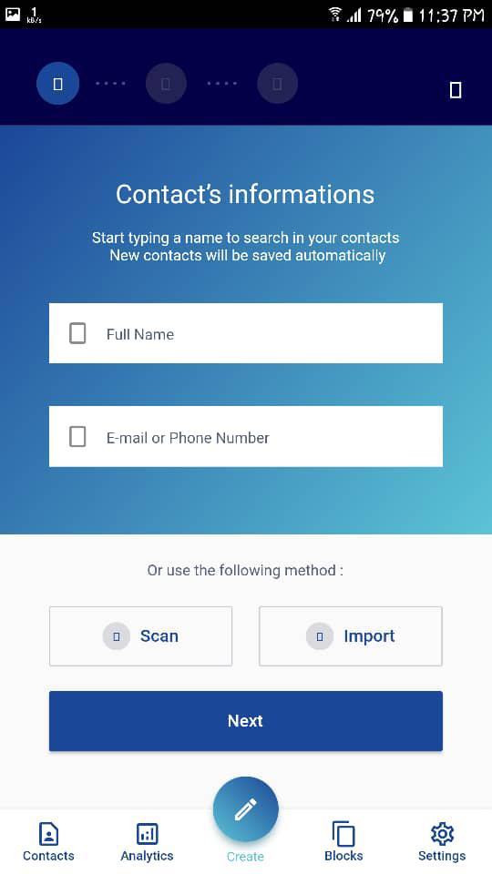
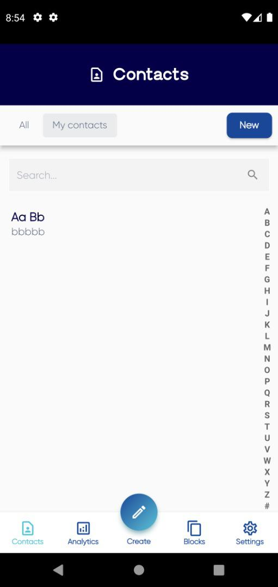
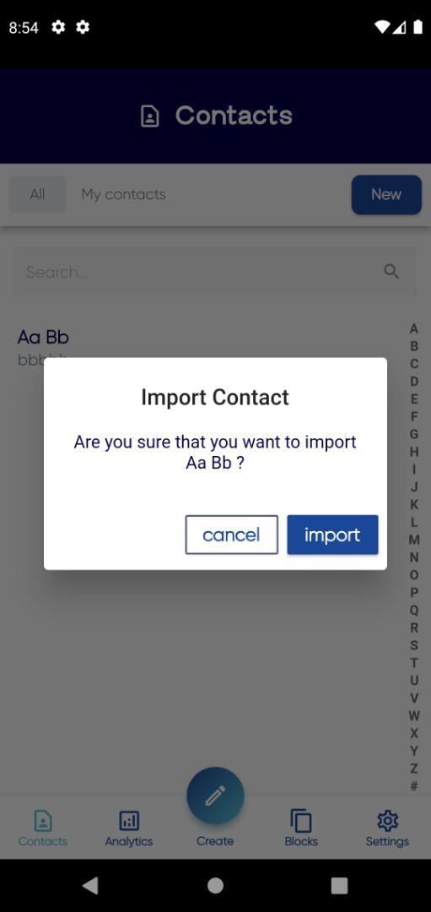

# Momail - AI-Powered Email Standardization and Business Card Scanner 📧🤖

Momail is an innovative application designed to simplify and standardize email management while utilizing AI to extract and organize key information from business cards. Whether you're managing multiple emails or networking with new contacts, Momail ensures everything is structured and efficient.

## Features
- **Email Standardization**: Consolidate and organize all your emails in one place with ease.
- **AI-Powered Business Card Scanner**: 
  - Extracts text from business cards.
  - Uses AI to detect key details like names, email addresses, and company names.
- **User-Friendly Interface**: A simple and intuitive experience for all users.

## Screenshots 📸
Check out some screenshots of Momail in action:







## Technologies Used
- **Flutter**: For a robust and cross-platform mobile application.
- **Dart**: The core language for app development.
- **AI Models**: Integrated for text extraction and data detection.
- **Firebase**: For backend services (if applicable).

## How to Use
1. Clone the repository:
   ```bash
   git clone https://github.com/yourusername/momail.git
